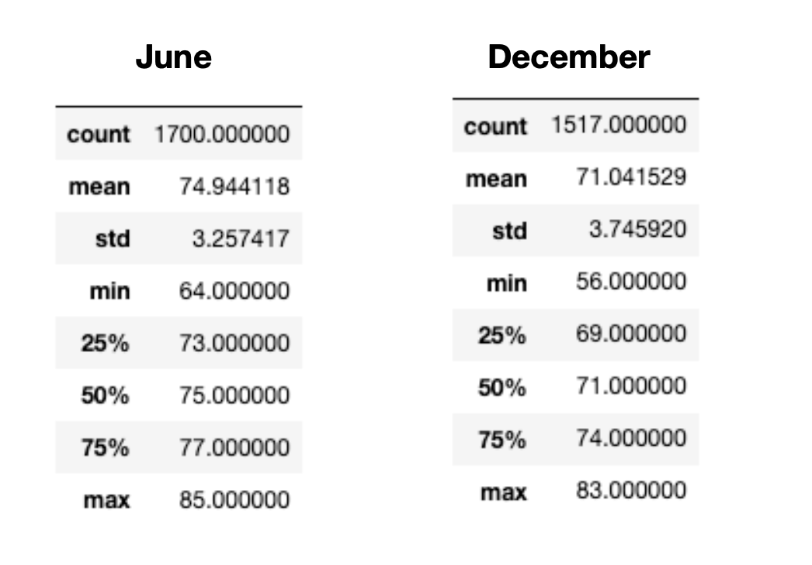

# 1. Overview of Surfs_up Analysis

## 1.1. Purpose
Toe review weather patterns in Hawaii as we look to open a surf and ice cream shop. This project focused on the weather temperature in June and December, looking at different statistics between the two periods to help assess whether an ice cream/surf shop would have good weather conditions in which to operate.

## 2. Results
The following table summarize June's and December's temperature statistics over time.

  

From this information we can observe the following resutls:

Average temperature between June and December is 75 and 71 degrees respectively, show a moderate temperature and very little fluctuation between the two periods from an average standpoint.
the maximum temperatures of 85 (June) and 83 (December) are also remarkable similar.
the minimum temperature of 56 (December) and 64 (June) show the greatest variance, and reflects a much lower temperature level in December that may not be conducive to ice cream or surfing. However, with standard deviations of 3.25 (June) and 3.74 (December) we would expect a little more variation in the december numbers.

## 3. Summary
Oevrall the weather in December and June are historically very similar, although December has a wider range of results, with its high being close to June's but its low well below June's.
